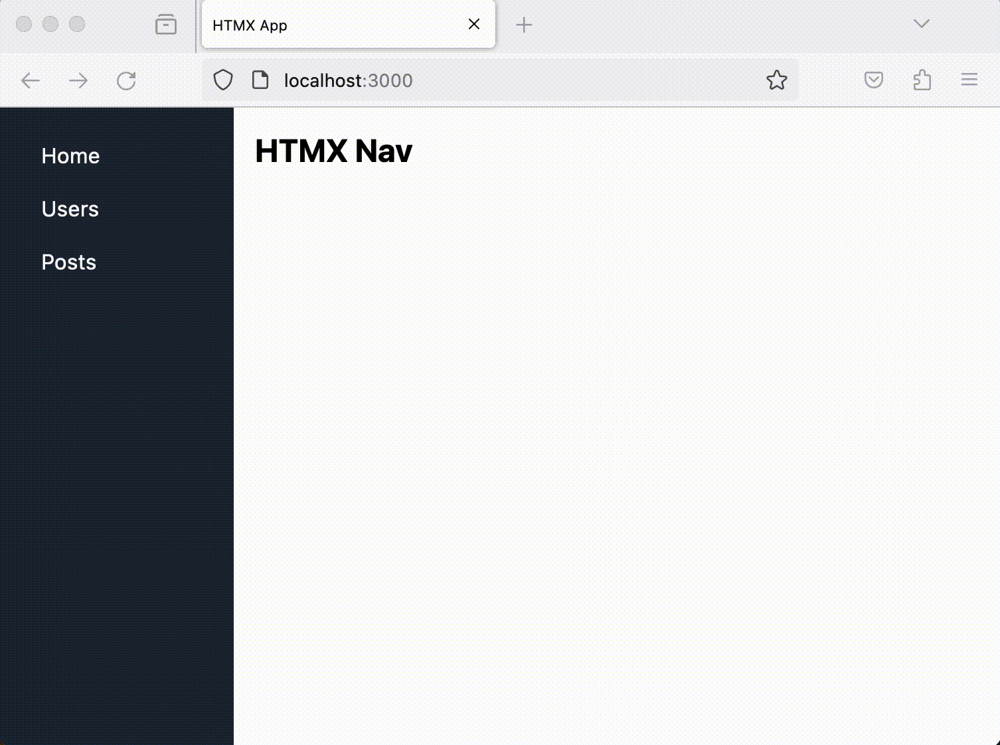
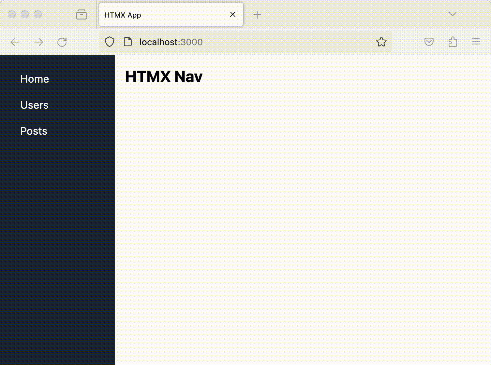

# Astro-HTMX Project

In this project we discuss how we can use HTMX with Astro.

## Setup Astro Project
```bash
npm create astro@latest
```
You can run create astro anywhere on your machine, so there’s no need to create a new empty directory for your project before you begin. If you don’t have an empty directory yet for your new project, the wizard will help create one for you automatically.


## Configure Astro Server for a Dynamic HTML(Web Application)
Because we need server-side rendering (SSR) for HTMX, we need to enable the Astro project for on-demand server rendering.

```mjs
//astro.config.mjs
import { defineConfig } from 'astro/config';
import node from "@astrojs/node";

export default defineConfig({
  output: 'server',
  adapter: node({
    mode: "standalone"
  })
});
```
The application will now run like an Express App instead of a static website.


## Integrate TailwindCSS 
To help with styling let's further configure the project and include TailwindCSS integration.

```bash
pnpm astro add tailwind
```

This will allow us to add TailwindCSS classes to our HTML elements

## Project Structure
Before we start, let's add a components and layouts directory

```
src
  components
    sidenav.astro
  layouts
    main.astro
  pages
    index.astro
    users.astro
    posts.astro
```

## Default Layout
We'd like all pages to extend the main layout

```html
<!--src/layouts/main.astro-->
---
import SideNav from "../components/side-nav.astro";
---
<html lang="en">
  <head>
    <meta charset="UTF-8" />
    <meta name="viewport" content="width=device-width, initial-scale=1.0" />
    <title>HTMX App</title>
  </head>

  <body class="bg-gray-200">
    <div class="flex h-screen">
      <SideNav />
      <div class="w-full bg-white" id="main">
        <slot />
      </div>
    </div>
  </body>
</html>
```

Note that we are using a component called a SideNav this would typically exist in the components directory

```html
<!--src/components/side-nav.astro-->
<div class="w-56 bg-gray-800 text-white p-4" >
    <a
        href="/"        
        class="block py-2 px-4 text-white hover:bg-gray-600">Home</a
    >
    <a
        href="/users"
        class="block py-2 px-4 text-white hover:bg-gray-600">Users</a
    >
    <a
        href="/posts"
        class="block py-2 px-4 text-white hover:bg-gray-600">Posts</a
    >
</div>

```

## Home Page

All other pages will now be injected into the main layout.


```html
<!--src/pages/index.astro-->
---
import MyLayout from "../layouts/main.astro";
---

<MyLayout>
	<h1 class="text-2xl font-bold mb-4">HTMX Nav</h1>
</MyLayout>

```

Let's add a couple more pages

```html
<!--src/pages/users.astro-->
---
import MyLayout from "../layouts/main.astro";
---

<MyLayout>
	<h1 class="text-2xl font-bold mb-4">Users</h1>
</MyLayout>

```

```html
<!--src/pages/posts.astro-->
---
import MyLayout from "../layouts/main.astro";
---

<MyLayout>
	<h1 class="text-2xl font-bold mb-4">Posts</h1>
</MyLayout>

```

Let's run the application:

```bash
npm run dev
```

When we run the server we have navigation, but with full page reloads:




We must address this issue by incorporating a lightweight JavaScript library known as HTMX. This library can greatly enhance the user navigation experience by making it more seamless and interactive. It's important to note that HTMX has a broader range of applications, but for our current purposes, we will focus solely on leveraging its capabilities to achieve smoother navigation.

The fastest way to get going with htmx is to load it via a CDN. You can simply add this to your head tag and get going:

```html
<!--File: src/layouts/main.astro-->
...
    <script src="https://unpkg.com/htmx.org@latest"></script>
    <title>HTMX App</title>
</head>
...
```

Lets now make changes to anchor tags in our sidenav

```html
<div class="w-56 bg-gray-800 text-white p-4" hx-target="#main">
    <a
        hx-get="/"
        hx-push-url="true"
        class="block py-2 px-4 text-white hover:bg-gray-600">Home</a
    >
    <a
        hx-get="/users"
        hx-push-url="true"
        class="block py-2 px-4 text-white hover:bg-gray-600">Users</a
    >
    <a
        hx-get="/posts"
        hx-push-url="true"
        class="block py-2 px-4 text-white hover:bg-gray-600">Posts</a
    >
</div>

```

* We've substituted `href` with 'hx-get'. This modification initiates a server request for content at those specified routes on click.
* We've introduced 'hx-push-url="true"' to all anchor elements. This setting ensures that when an anchor is clicked, the URL is pushed.
* Additionally, we've included 'hx-target="#main"' to instruct HTMX to identify the DOM div with the 'main' id and inject the response from 'hx-get' into it.

We now have the following:



While we successfully resolved the flicker and push state issues, a new challenge has emerged. When making an 'hx-get' request, the layout is also included in the response. However, in such cases, we only require the content itself, and the layout elements must be removed.

To address this issue, we must establish a way to differentiate between incoming server requests, distinguishing between HTMX calls and other requests. To achieve this, we'll need to implement specialized middleware.

## Make Application HTMX Aware
To add middleware to an Astro project we simply add a file named middleware.js to the src directory

```js
// src/middlewware.js
import { defineMiddleware } from "astro/middleware";

export const onRequest = defineMiddleware((context, next) => {
    context.locals.isHTMX = context.request.headers.get("HX-Request") === "true";
    return next();
});
```

If the "HX-Request" header is indeed "true", context.locals.isHTMX will be set to true. Otherwise, it will be false. This will now be used in the main layout

```html
<!-- src/layouts/main.astro-->
---
import SideNav from "../components/side-nav.astro";
const { isHTMX = Astro.locals.isHTMX } = Astro.props;
---

{isHTMX && <slot />}
{
    !isHTMX && (
        <html lang="en">
            <head>
                <meta charset="UTF-8" />
                <meta
                    name="viewport"
                    content="width=device-width, initial-scale=1.0"
                />

                <script src="https://unpkg.com/htmx.org@latest" />
                <script src="https://unpkg.com/hyperscript.org@latest" />
                <title>HTMX App</title>
            </head>

            <body class="bg-gray-200">
                <div class="flex h-screen">
                    <SideNav />

                    <div class="w-full bg-white" id="main">
                        <slot />
                    </div>
                </div>
            </body>
        </html>
    )
}

```

We’ve now accomplished a seamless and flicker-free navigation experience that allows for sharing URLs.


